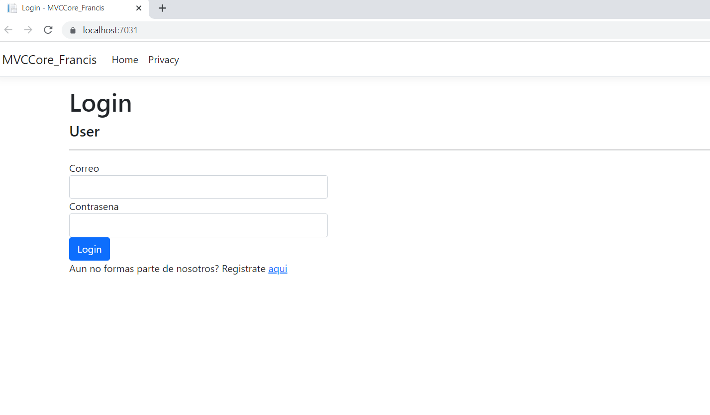
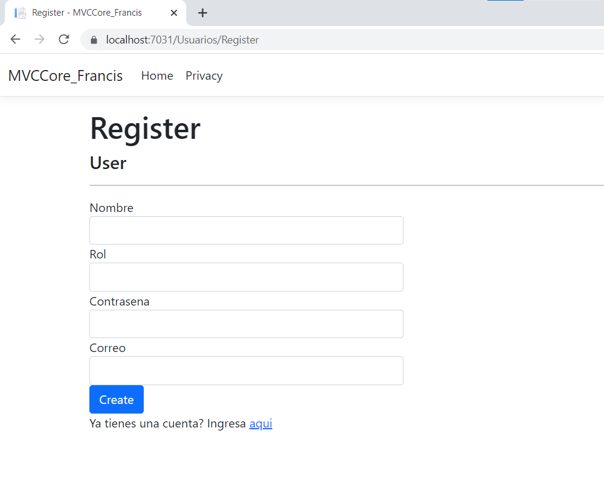
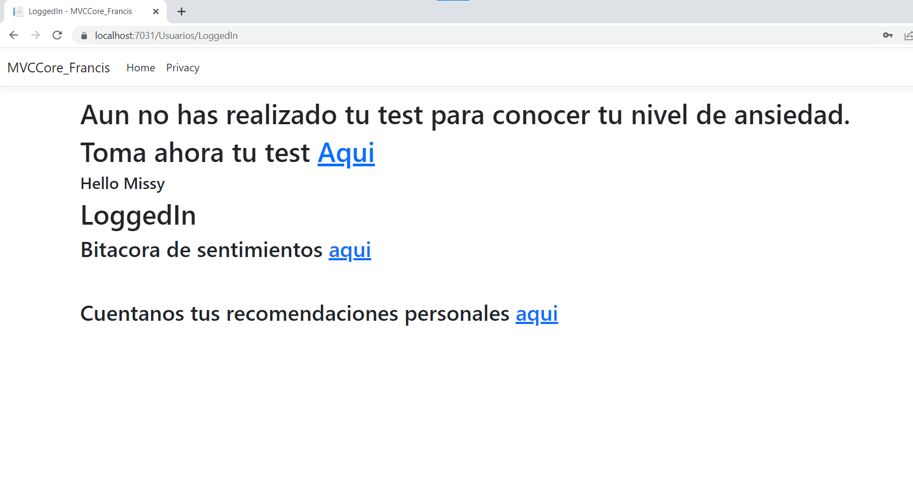
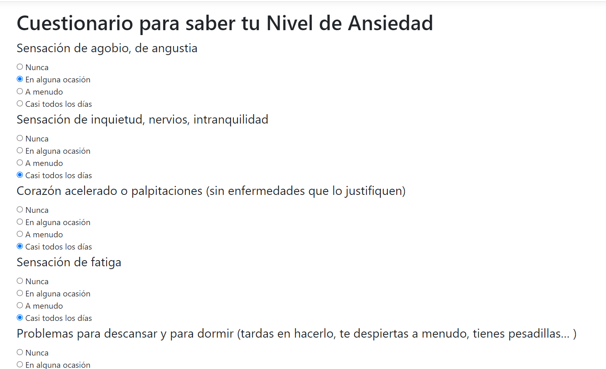
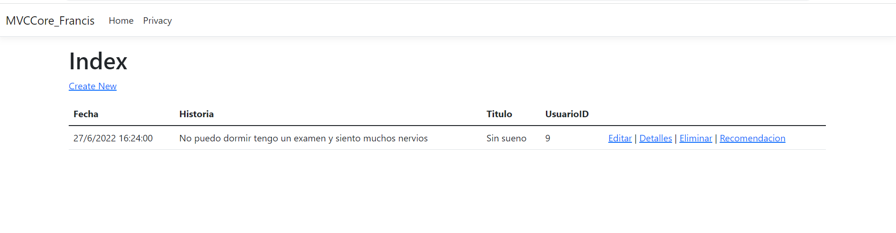
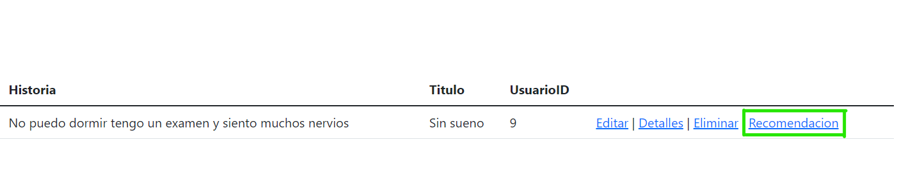
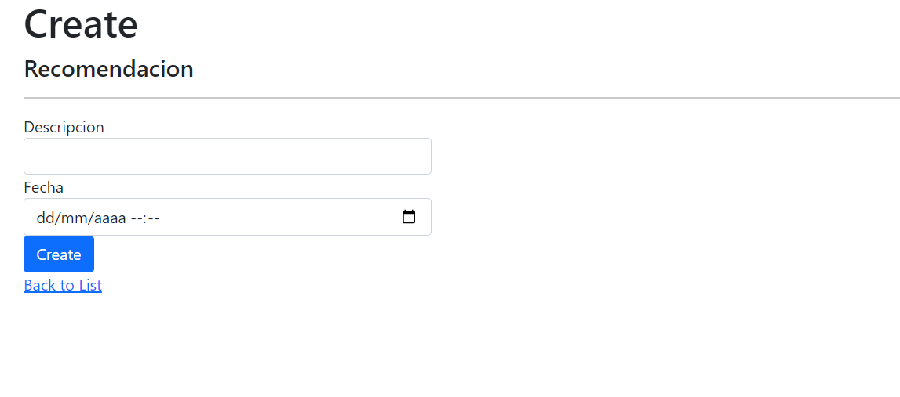

## Descripcion 

Esta aplicacion fue creada con el fin de poder ayudar a las personas que sufren de ansiedad, para que puedan tener conocimiento de su nivel de ansiedad (nula,baja, moderada o grave) mediante un test de preguntas de opcion multiple con sus respectivos puntajes para asi poder saber en que nivel se encuentra el usuario, por otro lado de igual menera existe la opcion de "Bitacora diaria", donde el usuario podra poner como se siente ese dia y que sintomas presenta, la otra opcion es la de "Recomendaciones" donde el usuario va a poder ingresar y poner recomendaciones que le ayudaron para poder controlar los diferentes sintomas de la ansidad. Todo esto con el fin de que se pueda realizar una comparacion con la Bitacora diaria ya que en la parte de la descripcion el usuario pondra los sintomas que esta presentando lo cual comparara con nuestro diccionario de datos (sintomas de la ansiedad), para que asi de manera automatica se le desplegue en la parte derecha de su bitacora una recomendacion con relacion a los sintomas que el usuario escribio en su bitacora diaria, en donde se le desplegaran todos las recomendaciones que pusieron otros usuarios y le prodrian ayudar con los sintomas que esta presentando. Este proyecto no esta diagnosticando ni medicando, su principal objetivo es ayudar a las personas que padecen de ansiedad y no saben como pueden controlar los diferentes sintomas, por lo cual consideramos que es muy importante siempre priorizar y pedir ayuda a personas especializadas en el tema como son los psiquiatras o los psicologos. Porque tu salud mental es muy importante. 

## Core Deployado
(https://proyecto-core.herokuapp.com/)

## Tecnologias

* [ASP.NET](https://dotnet.microsoft.com/en-us/apps/aspnet)
* [Entity Framework](https://docs.microsoft.com/en-us/ef/)
* [Visual Studio 2022](https://visualstudio.microsoft.com/es/)
* [Microsoft SQL Server](https://docs.microsoft.com/en-us/sql/ssms/sql-server-management-studio-ssms?view=sql-server-ver16)

## Ilustraciones del Proyecto

### Login 

Una vez que compilemos el proyecto la página principal que se nos va a desplegar va hacer del Login para poder entrar al aplicativo, donde debemos llenar con nuestro respectivo usuario y contraseña para esto primero debemos registramos para asi poder entrar al aplicativo.

### Registro

Si el usuario no cuenta con una usuario y contraseña, debera registrarse primero llenando los campos requeridos. Para esto debe primero llenar los datos requeridos como su nombre y apellido, su correo electronico y poner una contraseña, estas le serviran para entrar al aplicativo en la parte del LOGIN. 

## Página principal

En la en la página principal podemos encontrar las 3 opciones la primera es para poder realizar el test para poder saber el nivel de ansiedad, la segunda opción para poder llevar el registro diaria y la tercera opcion para poder escribir nuestras recomendaciones personales sobre como controlar la ansiedad. 

## Cuestionario

Se desplega un cuestionario con varias preguntas para poder conocer el nivel de ansiedad segun sus respuestas.

## Bitacora de Sentimientos

En esta sección el usuario podra documentar como se siente y así llevar su registro de que emociones o sintomas esta sintiendo esos momentos.

De igual manera en la parte derecha de la descripcion podra encontrar la opcion de "Recomendaciones" en donde se le desplegaran las recomendaciones que se relacionen o hcicieron match con la descripcion puesta en la bitacora de sentimientos esto mediante el diccionario de palabras claves. 

## Recomendaciones

Esta opcion es para que el usuario pueda ingresar lo que le ha ayudado para poder controlar su ansiedad y tambien para mostrar empatia con las personas que estan pasando por momentos dificiles y no saben como controlar los diferentes sintomas de la ansiedad. 

# Contact

* Personal e-mail: `francisalexander99@hotmail.com`
* Student e-mail: `francis.rios.tupiza@udla.edu.ec`
* WhatsApp: 0995630236